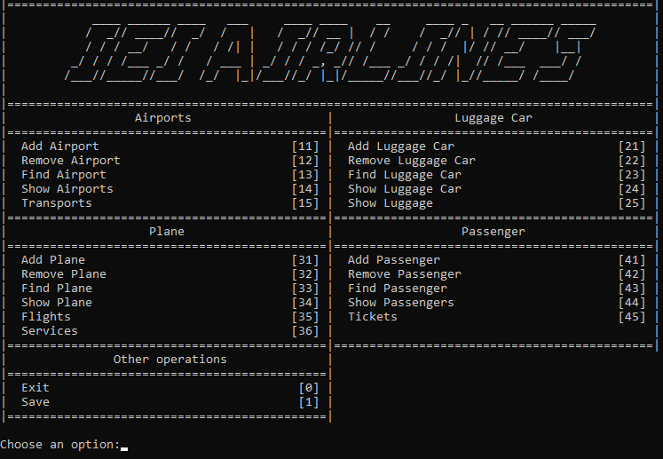
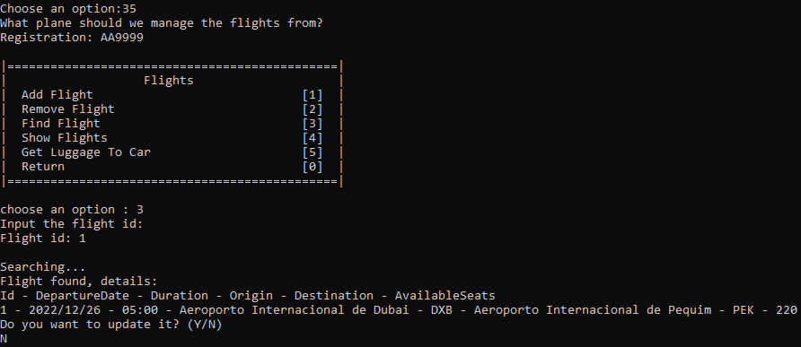

# Airport-System
## [Project Description](descricaoProjetoAED.pdf)
## Developers:
- Eduardo Duarte
- Ian Ítalo
- Igor Diniz

## Final grade: 17.1

## Context

This project was developed in the context of learning algorithms and data structures. It consists of managing the resources of an airline. The objective was to implement the management of the airline using adequate abstract data structures, in addition to thinking about improving temporal and spatial complexity. The data structures implemented were **stack, queue, doubly linked list, vector, and binary search tree (BST)**.

## Mockups

  <b><i>Fig 1. Main Menu </i></b>

  

 
 

  <b><i>Fig 2. Usage </i></b>

  

 
 

